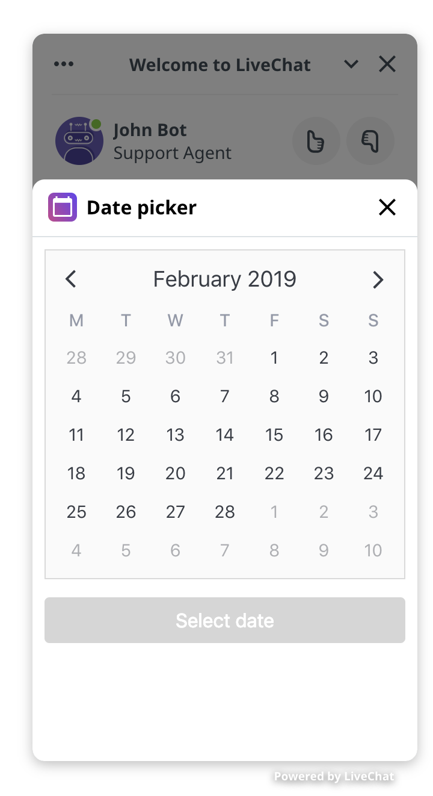

# Date picker

App written in Vue, allows a customer to pick any date from datepicker. It sends a chosen option back to a chat. Give the customer an option to choose the available term. Send a message with “choose term” button, open web application with data picker component, then send back chosen term to chat conversation as customer’s message.

<center>
    
</center>

## Getting started

### Install dependencies
```
npm install
```

### Compiles and hot-reloads for development
```
npm run serve
```

### Compiles and minifies for production
```
npm run build
```

### Run your tests
```
npm run test
```

### Lints and fixes files
```
npm run lint
```
